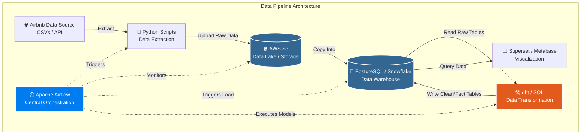

# 🏠 Airbnb ELT Pipeline

An end-to-end ELT pipeline that ingests Airbnb raw data from **Amazon S3** into **Snowflake**, transforms it through a medallion architecture using **dbt**, and orchestrates everything with **Apache Airflow** + **Astronomer Cosmos**.

---

## 📐 Architecture

```
┌─────────────┐     ┌──────────────────────────────────────────────────────────────┐     ┌──────────┐
│  Amazon S3  │────▶│                     Snowflake                                │────▶│ BI Tool  │
│             │     │  Raw → Bronze → Silver → Snapshots → Gold → Marts            │     │          │
│  listings/  │     └──────────────────────────────────────────────────────────────┘     └──────────┘
│  hosts/     │                              ▲
│  bookings/  │                              │
└─────────────┘                    ┌─────────────────┐
                                   │  Apache Airflow  │
                                   │  + dbt + Cosmos  │
                                   └─────────────────┘
```

---

## 🔄 Pipeline Flow



---

## 🗂️ Project Structure

```
airbnb-elt/
│
├── dags/
│   └── airbnb_elt_pipeline.py      # Main Airflow DAG
│
├── dbt/
│   └── airbnb-analytics/           # dbt project
│       ├── models/
│       │   ├── bronze/             # Raw → typed & cleaned
│       │   ├── silver/             # Business rules applied
│       │   ├── gold/               # Dims + Facts (star schema)
│       │   └── marts/              # OBTs for downstream tools
│       ├── snapshots/              # SCD Type 2 snapshots
│       ├── tests/                  # Custom data tests
│       └── dbt_project.yml
│
├── docs/
│   └── pipeline_diagram.png        # Architecture diagram
│
├── .env.example                    # Environment variable template
├── .gitignore
├── Dockerfile                      # Custom Airflow image
├── docker-compose.yml              # Full stack setup
├── pyproject.toml                  # Python dependencies
└── README.md
```

---

## 🛠️ Tech Stack

| Tool | Role |
|------|------|
| **Apache Airflow 3** | Pipeline orchestration |
| **Astronomer Cosmos** | dbt ↔ Airflow integration (per-model tasks) |
| **dbt (Snowflake)** | Data transformation & testing |
| **Snowflake** | Cloud data warehouse |
| **Amazon S3** | Raw data storage |
| **Docker + Compose** | Local development environment |
| **PostgreSQL** | Airflow metadata database |
| **Redis** | Celery message broker |

---

## ⚡ Quick Start

### Prerequisites

- [Docker Desktop](https://www.docker.com/products/docker-desktop/) installed and running
- [Git](https://git-scm.com/)
- Snowflake account
- AWS account with S3 bucket

### 1. Clone the repository

```bash
git clone https://github.com/your-username/airbnb-elt.git
cd airbnb-elt
```

### 2. Set up environment variables

```bash
cp .env.example .env
```

Open `.env` and fill in your credentials:

```bash
# Snowflake
SNOWFLAKE_ACCOUNT=your_account.region
SNOWFLAKE_USER=your_user
SNOWFLAKE_PASSWORD=your_password

# AWS
AWS_ACCESS_KEY_ID=your_key
AWS_SECRET_ACCESS_KEY=your_secret

# Email (Gmail example)
AIRFLOW__SMTP__SMTP_USER=your@gmail.com
AIRFLOW__SMTP__SMTP_PASSWORD=your_app_password   # Use App Password, not real password
```

### 3. Build and start the stack

```bash
# Build the custom Airflow image and start all services
docker compose up --build

# Or run in background
docker compose up --build -d
```

This spins up:
- Airflow API Server → http://localhost:8080
- PostgreSQL (Airflow metadata)
- Redis (Celery broker)
- Airflow Scheduler, Worker, Triggerer, DAG Processor

### 4. Open Airflow UI

```
URL:      http://localhost:8080
Username: airflow
Password: airflow
```

### 5. Configure Airflow Connections

Go to **Admin → Connections** and add:

| Conn ID | Type | Details |
|---------|------|---------|
| `snowflake-conn` | Snowflake | Account, user, password, database, warehouse, role |
| `aws-conn` | Amazon Web Services | Access key ID + Secret access key |
| `email-conn` | Email (SMTP) | Host: smtp.gmail.com, Port: 587 |

### 6. Trigger the DAG

In the Airflow UI, find `airbnb_elt_pipeline` and click ▶️ to trigger a manual run.

---

## 🧪 Running dbt Locally

```bash
cd dbt/airbnb-analytics

# Install dependencies
dbt deps

# Test source connections
dbt debug

# Run all models
dbt run

# Run tests
dbt test

# Run snapshots
dbt snapshot

# Generate docs
dbt docs generate
dbt docs serve
```

---

## 📊 Medallion Architecture

```
S3 (CSV files)
      │
      ▼
 ┌─────────┐
 │  Raw    │  Snowflake staging tables — exact copy of source CSVs
 └─────────┘
      │
      ▼
 ┌─────────┐
 │ Bronze  │  Type casting, null handling, timestamp standardization
 └─────────┘
      │
      ▼
 ┌─────────┐
 │ Silver  │  Deduplication, business rules, joins, incremental loads
 └─────────┘
      │
      ├──────────────▶ [ Snapshots ] SCD Type 2 — tracks historical changes
      │
      ▼
 ┌─────────┐
 │  Gold   │  Star schema — dimension + fact tables
 └─────────┘
      │
      ▼
 ┌─────────┐
 │  Marts  │  OBTs — one big tables optimized for BI tools
 └─────────┘
```

---

## 📬 Notifications

The pipeline sends email notifications on every run:

- ✅ **Success** — when all tasks complete successfully
- ❌ **Failure** — when any task fails, includes the exact failed task name and log URL

---

## 🛑 Stopping the Stack

```bash
# Stop all containers
docker compose down

# Stop and remove volumes (clears Airflow DB)
docker compose down --volumes
```

---

## 🤝 Contributing

1. Fork the repository
2. Create a feature branch: `git checkout -b feature/your-feature`
3. Commit changes: `git commit -m 'Add your feature'`
4. Push: `git push origin feature/your-feature`
5. Open a Pull Request

---

## 📄 License

This project is licensed under the MIT License.
