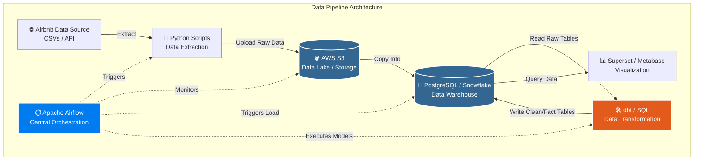

# 🏠 Airbnb ELT Pipeline

An end-to-end ELT pipeline that ingests Airbnb raw data from **Amazon S3** into **Snowflake**, transforms it through a medallion architecture using **dbt**, and orchestrates everything with **Apache Airflow** + **Astronomer Cosmos**.

---

## 📐 Architecture

```
┌─────────────┐     ┌──────────────────────────────────────────────────────────────┐     ┌──────────┐
│  Amazon S3  │────▶│                     Snowflake                                │────▶│ BI Tool  │
│             │     │  Raw → Bronze → Silver → Snapshots → Gold → Marts            │     │          │
│  listings/  │     └──────────────────────────────────────────────────────────────┘     └──────────┘
│  hosts/     │                              ▲
│  bookings/  │                              │
└─────────────┘                    ┌─────────────────┐
                                   │  Apache Airflow  │
                                   │  + dbt + Cosmos  │
                                   └─────────────────┘
```

---

## 🔄 Pipeline Flow



---

## 🗂️ Project Structure

```
airbnb-elt/
│
├── dags/
│   └── airbnb_elt_pipeline.py      # Main Airflow DAG
│
├── dbt/
│   └── airbnb-analytics/           # dbt project
│       ├── models/
│       │   ├── bronze/             # Raw → typed & cleaned
│       │   ├── silver/             # Business rules applied
│       │   ├── gold/               # Dims + Facts (star schema)
│       │   └── marts/              # OBTs for downstream tools
│       ├── snapshots/              # SCD Type 2 snapshots
│       ├── tests/                  # Custom data tests
│       └── dbt_project.yml
│
├── docs/
│   └── pipeline_dag.png            # Architecture diagram
│
├── .env.example                    # Environment variable template
├── .gitignore
├── Dockerfile                      # Custom Airflow image
├── docker-compose.yml              # Full stack setup
├── pyproject.toml                  # Python dependencies
└── README.md
```

---

## 🛠️ Tech Stack

| Tool | Role |
|------|------|
| **Apache Airflow 3** | Pipeline orchestration |
| **Astronomer Cosmos** | dbt ↔ Airflow integration (per-model tasks) |
| **dbt (Snowflake)** | Data transformation & testing |
| **Snowflake** | Cloud data warehouse |
| **Amazon S3** | Raw data storage |
| **Docker + Compose** | Local development environment |
| **PostgreSQL** | Airflow metadata database |
| **Redis** | Celery message broker |

---
